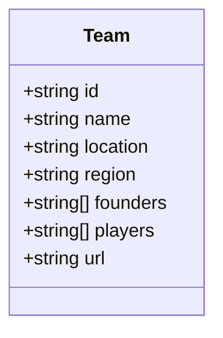
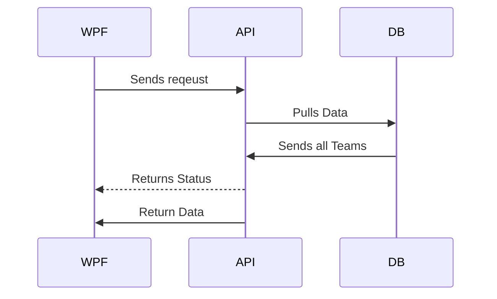
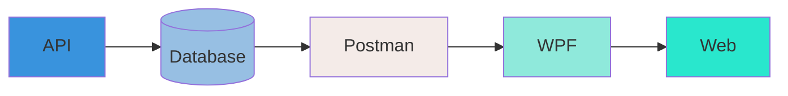

# CS:GO-Team-API

Als Pos-Projekt habe ich einen "Teamviewer" für [CS:GO](https://www.counter-strike.net/news)-Teams entwickelt. Mit diesem Programm können Teams erstellt, bearbeitet, gelöscht und angezeigt werden. Jedes Team hat die gleichen Attribute. Für die technische Umsetzung habe ich [Spring Boot](https://spring.io/projects/spring-boot) für die API gewählt, da wir bereits in DBI damit gearbeitet haben. Für den Webclient nutze ich [Blazor](https://dotnet.microsoft.com/en-us/apps/aspnet/web-apps/blazor), während die Verwendung einer WPF-App vorgegeben war. Um die Daten persistent zu speichern, habe ich mich für [MongoDB](https://www.mongodb.com/) entschieden. Für die Umsetzung habe ich folgende Programme genutzt:

-   [IntelliJ IDE](https://www.jetbrains.com/de-de/idea/) v. 2023.1.2
-   [Visual Studio](https://visualstudio.microsoft.com/de/) v. 2022 17.6
-   [Postman](https://www.postman.com/) v. 10.14
-   [MongoDB Compass](https://www.mongodb.com/products/compass) v. 1.36.4

## Spring-API

Die API besteht aus drei Klassen und einem Interface.

Die Klassen sind:

-   Team
-   TeamService
-   TeamController

Das Interface ist:

-   TeamRepository

### Team

Das Team ist die Grundklasse, in der die Attribute der Teams festgelegt sind. Jedes Team besitzt folgende Attribute: eine ID, einen Namen, eine Location, eine Region, Gründer, Spieler und eine URL für das Logo.

Man muss die Annotationen über Team und den Attributen hervorheben, da sie für MongoDB bestimmt sind. **@Document(collection = "Teams")** dient dazu, der Datenbank mitzuteilen, wo die Einträge gespeichert werden sollen. **@Id** signalisiert der DB, dass das darunter liegende Attribut die ID ist. **@Field("xxx")** zeigt an, dass das darunterliegende Feld ein Attribut ist, das auch so gespeichert werden soll.

### TeamService

Der TeamService stellt die grundlegenden Funktionen für die API bereit. Mit der Annotation **@Autowired** wird eine Verbindung mit dem Repository hergestellt. Das **@Service** signalisiert, dass diese Klasse einen Service darstellt.

### TeamController

Im TeamController werden nun die Routen gestaltet, die später für die CRUD-Funktionen genutzt werden. Als Beispiel dient die Route **/add/team**, bei deren Aufruf über Postman alle vorhandenen Teams aus der Datenbank zurückgegeben werden. Dabei sind die Annotationen **@RequestMapping**, **@PostMapping**, **@PutMapping** und **@DeleteMapping** wichtig, da sie festlegen, wie die HTTP-Requests behandelt werden sollen.

> **Hinweis:** Die oben genannten Annotationen sind verkürzte Formen.

Die Annotation **@RestController** kennzeichnet, dass diese Klasse als Controller behandelt werden soll, während **@CrossOrigin** später für die Web-App verwendet wird, um Probleme zu vermeiden.

### TeamRepository

Dies ist ein Interface, das das MongoRepository erweitert. Es dient dazu, grundlegende CRUD-Funktionen bereitzustellen. In diesem Fall handelt es sich um das MongoRepository, da MongoDB als Datenbank verwendet wird.

##	WPF	
Die WPF-App besteht aus einer Klasse namens Teams.cs und einer XAML-Datei namens MainWindow.xaml. Die MainWindow.xaml verfügt auch über eine C#-Datei, die die Funktionalität hinter der XAML-Datei darstellt. Die Teams.cs dient dazu, dass, wenn beispielsweise ein neues Team mit einer GET-Anfrage abgerufen wird, dieses als JSON-Objekt zurückkommt. Anschließend muss es deserialisiert werden und der Teams.cs-Klasse entsprechen. Zur Visualisierung wird ein TabControl verwendet. Es wurden vier Tabs erstellt: einer für die GET-Anfrage, einer für die POST-Anfrage, einer für die PUT-Anfrage und einer für die DELETE-Anfrage. Das Styling der WPF-Anwendung erfolgt mit XAML und nicht mit CSS. Das Styling ist in der MainWindow.xaml-Datei unter Window.Resources zu finden.

##	Web App
Die Web-App wurde mit dem Framework Blazor entwickelt, das von Microsoft stammt. In meinem Blazor-Projekt gibt es auch wieder eine "Team.cs"-Datei mit den gleichen Eigenschaften wie in der WPF-App. Außerdem gibt es zwei Seiten, "TeamDetails.razor" und "Teams.razor". Die "Teams.razor"-Seite ist auch meine Standardseite, das bedeutet, dass sie beim Starten des Projekts im Browser angezeigt wird. Die "TeamDetails.razor"-Seite dient dazu, dass ich beim Klicken auf ein Team weitergeleitet werde und dort die genauen Details des Teams anzeigen kann. Außerdem kann ich dort mein Team löschen, wenn ich dies möchte.

##	Postman
Postman habe ich genutzt um die funktionalität der API zu testen, als ich noch keine WPF-App bzw. Web-App hatte.
| Reqeust | Url |Bedingung | Return | Status |
|---------|-----|-----------|--------|-------|
|GET|localhost:25052/|keine|The service is running| OK|
|GET|localhost:8888/teams|keine|Alle Teams|keinen|
|GET|localhost:8888/team/{id}|Eine Id|Team mit der Id|OK/Not Found|
|POST|localhost:8888/add/team|Befüllter Body|Team Created/Fehler|Created/Internal Server Error|
|PUT|localhost:8888/team/{id}|Befüllter Body|Team ... updated/Team not found|Ok/Not Found|
|DEL|localhost:8888/del/team/{id}|Eine Id|Team deleted/Team not found|OK/Not Found|

## UML diagrams

UML Diagramme wurden mit [Mermaid](https://mermaidjs.github.io/) erstellt. 
Das Diagramm, das unterbei dargestellt ist, dient zur Veranschaung der Requests.

###	Entwicklungsverlauf
