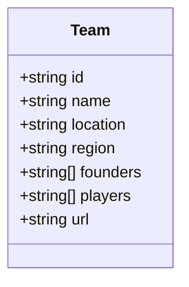
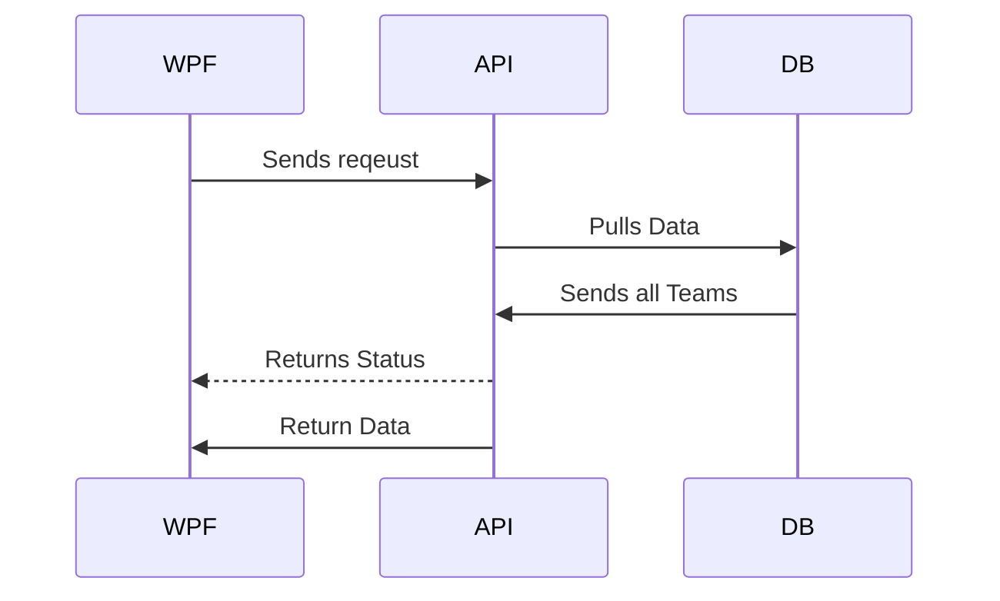
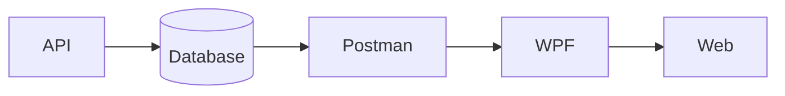

# CS:GO-Team-API

Als Pos-Projekt habe ich einen [CS:GO](https://www.counter-strike.net/news)-Team-API entwickelt. Mit diesem Programm können Teams erstellt, bearbeitet, gelöscht und angezeigt werden. Jedes Team hat die gleichen Attribute. Für die technische Umsetzung habe ich [Spring Boot](https://spring.io/projects/spring-boot) für die API gewählt, da wir damit bereits in DBI gearbeitet haben. Für den Webclient nutze ich [Blazor](https://dotnet.microsoft.com/en-us/apps/aspnet/web-apps/blazor), während die Verwendung einer WPF-App vorgegeben war. Um die Daten persistent zu speichern, habe ich mich für [MongoDB](https://www.mongodb.com/) entschieden. Für die Umsetzung habe ich folgende Programme genutzt:

-   [IntelliJ IDE](https://www.jetbrains.com/de-de/idea/) v. 2023.1.2
-   [Visual Studio](https://visualstudio.microsoft.com/de/) v. 2022 17.6
-   [Postman](https://www.postman.com/) v. 10.14
-   [MongoDB Compass](https://www.mongodb.com/products/compass) v. 1.36.4

## Spring-API

Die API besteht aus drei Klassen und einem Interface.

Die Klassen sind:

-   [Team](https://github.com/ThisIsCed/CSGO-TEAM-API/blob/main/API/src/main/java/com/example/Pos/Team.java)
-   [TeamService](https://github.com/ThisIsCed/CSGO-TEAM-API/blob/main/API/src/main/java/com/example/Pos/TeamService.java)
-   [TeamController](https://github.com/ThisIsCed/CSGO-TEAM-API/blob/main/API/src/main/java/com/example/Pos/TeamController.java)

Das Interface ist:

-   [TeamRepository](https://github.com/ThisIsCed/CSGO-TEAM-API/blob/main/API/src/main/java/com/example/Pos/TeamRepository.java)

### Team

Das Team ist die Grundklasse, in der die Attribute der Teams festgelegt sind. Jedes Team besitzt folgende Attribute: eine ID, einen Namen, eine Location, eine Region, Gründer, Spieler und eine URL für das Logo.

Man muss die Annotationen über Team und den Attributen hervorheben, da sie für MongoDB bestimmt sind. **@Document(collection = "Teams")** dient dazu, der Datenbank mitzuteilen, wo die Einträge gespeichert werden sollen. **@Id** signalisiert der DB, dass das darunter liegende Attribut die ID ist. **@Field("xxx")** zeigt an, dass das darunterliegende Feld ein Attribut ist, das auch so gespeichert werden soll.

### TeamService

Der TeamService stellt die grundlegenden Funktionen für die API bereit. Mit der Annotation **@Autowired** wird eine Verbindung mit dem Repository hergestellt. Das **@Service** signalisiert, dass diese Klasse einen Service darstellt.

### TeamController

Im TeamController werden nun die Routen gestaltet, die später für die CRUD-Funktionen genutzt werden. Als Beispiel dient die Route **/add/team**, bei deren Aufruf über Postman alle vorhandenen Teams aus der Datenbank zurückgegeben werden. Dabei sind die Annotationen **@RequestMapping**, **@PostMapping**, **@PutMapping** und **@DeleteMapping** wichtig, da sie festlegen, wie die HTTP-Requests behandelt werden sollen.

> **Hinweis:** Die oben genannten Annotationen sind verkürzte Formen.

Die Annotation **@RestController** kennzeichnet, dass diese Klasse als Controller behandelt werden soll, während **@CrossOrigin** später für die Web-App verwendet wird, um Probleme zu vermeiden.

### TeamRepository

Dies ist ein Interface, das das MongoRepository erweitert. Es dient dazu, grundlegende CRUD-Funktionen bereitzustellen. In diesem Fall handelt es sich um das MongoRepository, da MongoDB als Datenbank verwendet wird.

##	WPF	
Die WPF-App besteht aus einer Klasse namens Teams.cs und einer XAML-Datei namens MainWindow.xaml. Die MainWindow.xaml verfügt auch über eine C#-Datei, die die Funktionalität hinter der XAML-Datei darstellt. Die Teams.cs dient dazu, dass, wenn beispielsweise ein neues Team mit einer GET-Anfrage abgerufen wird, dieses als JSON-Objekt zurückkommt. Anschließend muss es deserialisiert werden und der Teams.cs-Klasse entsprechen. Zur Visualisierung wird ein TabControl verwendet. Es wurden vier Tabs erstellt: einer für die GET-Anfrage, einer für die POST-Anfrage, einer für die PUT-Anfrage und einer für die DELETE-Anfrage. Das Styling der WPF-Anwendung erfolgt mit XAML und nicht mit CSS. Das Styling ist in der MainWindow.xaml-Datei unter Window.Resources zu finden.

### Vorschau
Dies ist die Ansicht, die man erhält, wenn man die WPF-App startet. Dafür muss der Service im Hintergrund laufen.

Wenn der Service nicht läuft, sieht es so aus:

Wenn man sich dann alle Teams holt, sieht es wie folgt aus:

Falls man nur ein einzelnes Team abrufen möchte, sieht es so aus:

Man kann auch in der WPF-Anwendung Teams hinzufügen:

Nachdem man das getan hat, erhält man folgendes:

Es ist auch möglich, Teams zu aktualisieren:

Und es gibt auch die Möglichkeit, ein Team zu löschen:

> **Hinweis:** Nach dem Aktualisieren oder Löschen eines Teams erhält man, ähnlich wie beim Hinzufügen, eine MessageBox.
##	Web App
Die Web-App wurde mit dem Framework Blazor entwickelt, das von Microsoft stammt. In meinem Blazor-Projekt gibt es auch eine "Team.cs"-Datei mit den gleichen Eigenschaften wie in der WPF-App. Insgesamt gibt es zwei Seiten: "Index" und "Details.razor". Die "Index.razor" ist meine Standardseite, auf die man weitergeleitet wird, sobald man die Web-App startet. Dort befindet sich eine Suchleiste, in der man gezielt nach einem Team suchen kann. Zusätzlich erhält man eine Übersicht über alle Teams, die in der Datenbank gespeichert sind, in Form von Namen und Logo. Man kann auf den Namen oder das Logo klicken, um zur Detailseite des Teams weitergeleitet zu werden. Dort kann man alle Attribute des Teams einsehen, und es gibt auch einen "Delete"-Button, falls man das Team löschen möchte. Für die Gestaltung benutze ich .razor-Komponenten, in denen ich den HTML-, CSS- und C#-Code für die jeweiligen Komponenten schreibe.
###	Liste an Komponenten
 - [DeleteButton.razor](https://github.com/ThisIsCed/CSGO-TEAM-API/blob/main/WebApp/WebApp/Components/DeleteButton.razor)
 - [MainGrid.razor](https://github.com/ThisIsCed/CSGO-TEAM-API/blob/main/WebApp/WebApp/Components/MainGrid.razor)
 - [Navbar.razor ](https://github.com/ThisIsCed/CSGO-TEAM-API/blob/main/WebApp/WebApp/Components/Navbar.razor)
 - [Searchbar.razor ](https://github.com/ThisIsCed/CSGO-TEAM-API/blob/main/WebApp/WebApp/Components/Searchbar.razor)
 ###	Liste an Pages
 - [Index.razor](https://github.com/ThisIsCed/CSGO-TEAM-API/blob/main/WebApp/WebApp/Pages/Index.razor)
 - [Details.razor](https://github.com/ThisIsCed/CSGO-TEAM-API/blob/main/WebApp/WebApp/Pages/Details.razor)
### Vorschau
So sieht meine Indexpage aus, wenn man die WebApp ausführt und der Service läuft.

Falls der Service nicht läuft, sieht es wie folgt aus.

Die Ansicht wenn man die Detailansicht für ein Team öffnet.

> **Hinweis:** In der Web-Anwendung kann man Teams nur suchen und löschen.
##	Postman
Postman habe ich genutzt, um die funktionalität der API zu testen, als ich noch keine WPF-App bzw. Web-App hatte.
| Reqeust | Url |Bedingung | Return | Status |
|---------|-----|-----------|--------|-------|
|GET|localhost:8888/|keine|The service is running| OK|
|GET|localhost:8888/teams|keine|Alle Teams|OK/No Content|
|GET|localhost:8888/team/{name}|Name|Team|OK/Not Found|
|POST|localhost:8888/add/team|Befüllter Body|Team Created/Fehler|Created/Internal Server Error|
|PUT|localhost:8888/team/{name}|Befüllter Body|Team ... updated/Team not found|Ok/Not Found|
|DEL|localhost:8888/del/team/{name}|Name|Team deleted/Team not found|OK/Not Found|

## UML-Diagrams

UML-Diagramme wurden mit [Mermaid](https://mermaidjs.github.io/) erstellt. 
Das Diagramm, das unterbei dargestellt ist, dient zur Veranschaung der Requests.

###	Entwicklungsverlauf
In der Entwicklung habe ich mit der API begonnen, da diese als Grundstein für das Projekt fungiert. Danach habe ich mit MongoDB Compass eine neue Collection angelegt und in meiner application.propperties habe ich den Pfad zur Collection hinzugefügt, damit die API dort die Daten persistent speichert. Nach dem Anlegen der DB habe ich mit Postman die API auf Herz und Nieren durchgeprüft. Daraufhin habe ich mich an die WPF-Application gemacht und zum Schluss die Web-App.
